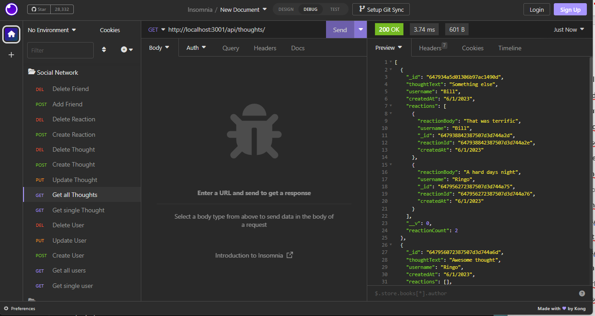
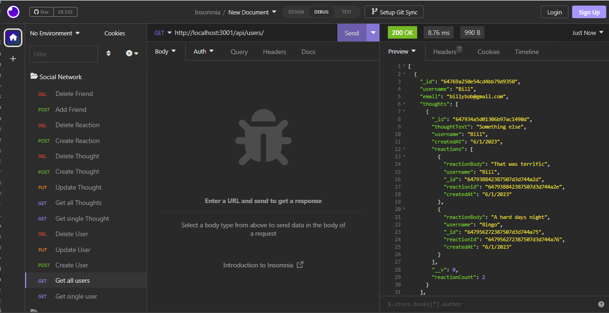

Social Network API, NoSQL

## Table of Contents
- [Description](#description)
- [User Specifications](#user-specifications)
- [Functionality](#functionality)
- [Mock-Up](#mock-up)
- [Walkthrough Video](#walkthrough)
- [Screenshots](#screenshots)
- [Deliverables](#deliverables)

## Description

This challenge is to build an API for a social network web application where users can share their thoughts, react to friends’ thoughts, and create a friend list. Express.js will be used for routing, a MongoDB database, and the Mongoose ODM. 

## User Specifications

AS A social media startup
I WANT an API for my social network that uses a NoSQL database
SO THAT my website can handle large amounts of unstructured data

## Functionality

GIVEN a social network API:

When the user enters the command to invoke the application, the server is started and the Mongoose models are synced to the MongoDB database.

When the user opens the API GET routes in Insomnia for users and thoughts, the data for each of these routes is displayed in a formatted JSON.

When the user tests the API POST, PUT, and DELETE routes in Insomnia, the user is able to successfully create, update, and delete users and thoughts in the database.

When the user tests API POST and DELETE routes in Insomnia, the user is able to successfully create and delete reactions to thoughts and add and remove friends to a user’s friend list.

## Mock Up

The following animations show examples of the application's API routes being tested in Insomnia.

The following animation shows GET routes to return all users and all thoughts being tested in Insomnia:

The following animation shows GET routes to return a single user and a single thought being tested in Insomnia:

The following animation shows the POST, PUT, and DELETE routes for users being tested in Insomnia:

In addition to this, your walkthrough video should show the POST, PUT, and DELETE routes for thoughts being tested in Insomnia.

The following animation shows the POST and DELETE routes for a user’s friend list being tested in Insomnia:

In addition to this, your walkthrough video should show the POST and DELETE routes for reactions to thoughts being tested in Insomnia.

## Walkthrough Video

A walkthrough video that demonstrates the functionality of the social media API must be submitted, and a link to the video should be included in your README file.

The walkthrough video must show all of the technical acceptance criteria being met.

The walkthrough video must demonstrate how to start the application’s server.

The walkthrough video must demonstrate GET routes for all users and all thoughts being tested in Insomnia.

The walkthrough video must demonstrate GET routes for a single user and a single thought being tested in Insomnia.

The walkthrough video must demonstrate POST, PUT, and DELETE routes for users and thoughts being tested in Insomnia.

Walkthrough video must demonstrate POST and DELETE routes for a user’s friend list being tested in Insomnia.

Walkthrough video must demonstrate POST and DELETE routes for reactions to thoughts being tested in Insomnia.

Endpoints:
GET /api/users - get all users

GET /api/users/:userId - get a single user by ID

POST /api/users - create a new user

PUT /api/users/:userId - update a user by ID

DELETE /api/users/:userId - delete a user by ID

GET /api/thought - get all thought

GET /api/thought/:thoughtId - get a single thought by ID

POST /api/thought - create a new thought

PUT /api/thought/:thoughtId - update a thought by ID

DELETE /api/thought/:thoughtId - delete a thought by ID

POST /api/thought/:thoughtId/reactions - add a reaction to a thought

DELETE /api/thought/:thoughtId/reactions/:reactionId - remove a reaction from a thought

POST /api/users/:userId/friends/:friendId - add a friend to a user's friend list

DELETE /api/users/:userId/friends/:friendId - remove a friend from a user's friend list

## Screenshots

## Deliverables

* A walkthrough video demonstrating the functionality of the application and all of the acceptance criteria being met:  https://watch.screencastify.com/v/xYNZgWMHCRPJzlj43r4M

* The URL of the GitHub repository:  https://github.com/dawn-kline-m/Social-Network-API

